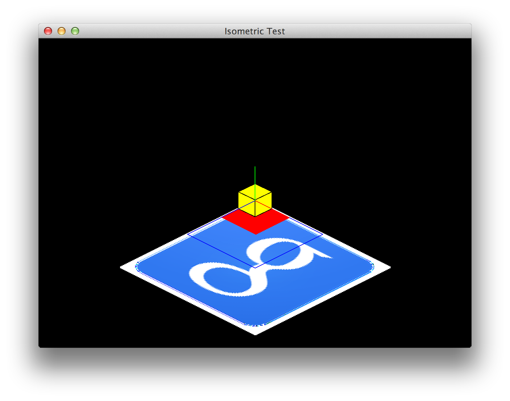

# isometric-java

Java port of [Pebble isometric library](https://github.com/C-D-Lewis/isometric).

Place a png in 'res/test.png' alongside compiled `jar` file to see an
isometrically rendered texture.